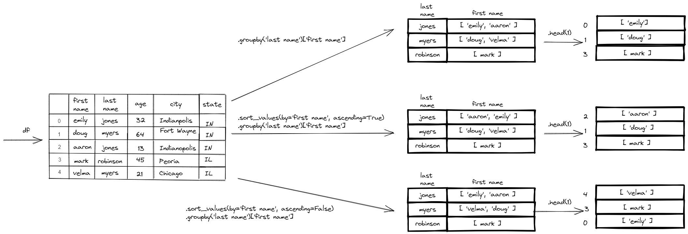

# pandas-adv-groupby

<cite>Photo by [Debbie Molle](https://unsplash.com/@djmle29n?utm_source=unsplash&utm_medium=referral&utm_content=creditCopyText) on [Unsplash](https://unsplash.com/s/photos/pandas?utm_source=unsplash&utm_medium=referral&utm_content=creditCopyText)</cite>

 

> Purpose:  Often people don't realize that tasks sometimes performed with `for loops` can actaully be completed by using a `pandas dataframe` and `groupby` method if the pattern is consistent.  If more complex conditions are needed then a `for loop` would be necessary or a multistep solution using pandas.  

   

## Overview  

In this file, we import in a file of historical songs and their annual rankings by year.  The data file has several issues that need resolved before applying a groupby.  

An example of how to use pandas dataframes to find ordered data is provided.  In this case, we order the data by the 'Annual Ranking' and then find the first two rows of each year.  This is a nice example that shows how the groupby method works.  

 

## Status
Some touchup will be made to the code but the content for this activity is mostly complete.  

 

## Technologies
* Python
* Pandas  
* Matplotlib

 

## Data Source  
Grimi94 (April 8, 2016). data-science-music (commit 7779de0).    https://github.com/Grimi94/data-science-music.  (Accessed March 31, 2022).

   

## Setup and Installation  
1. Environment needs the following:  
    *  Python 3.6+  
    *  Pandas  
1. Activate your environment
1. Clone the repo to your local machine
1. Start Jupyter Notebook within the environment from the repo
1. Run `pandas-groupby-songs.ipynb` 

 

## Analysis  
There is no real analysis to provide.  The take aways of the activity show the following:  
*  `.groupby(column)` starts at the top of the dataframe and adds the values to lists for each column.  In Fig.1, the top path shows a groupby of by one column (last name) with only one other column(first name).  The order of the values in the list is based on the order that the data appears in the dataframe.  
*  `.sort_values(by=column, ascending=True).groupby(column)` first sorts the datafram from smallest to largest value for numerical values or from a-z for text values for the specified column.  Next, the data is grouped based on the order of the data from the top of the dataframe to the bottom of the dataframe.  
*  `.sort_values(by=column, ascending=False).groupby(column)` first sorts the dataframe from largest to smallest value for numerical values or from z-a for text values for the specified column.  Next, the data is grouped based on the order of the data from the top of the dataframe to the bottom of the dataframe.  

<figure>

<figcaption>Fig.1 - Diagram of what sorting, groupby, and list methods do</figcaption>
</figure>

*  series methods like `.head(x)` can be used to obtain the first x values.
*  series methods like `.apply(list)` convert the groupby object into lists.  This is helpful when you need a list of lists such as inputs for pandas boxplots. 

 
